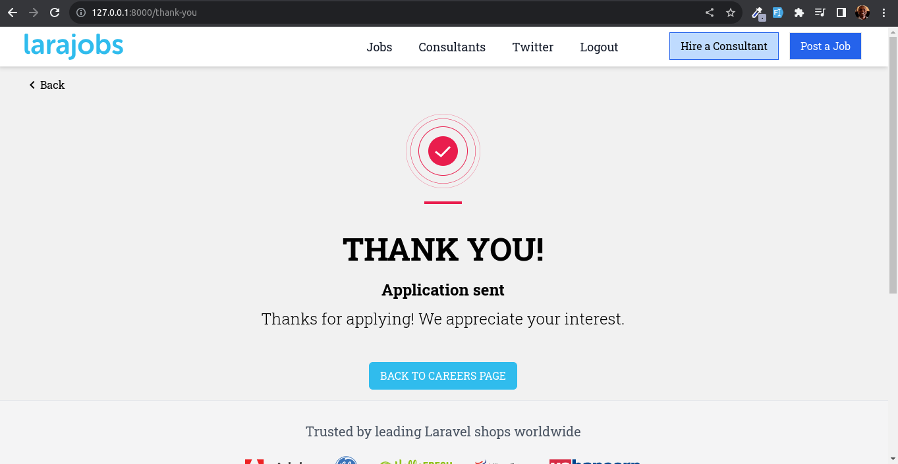

# Job Board

Welcome to the README for Job Board project. This document provides an overview of the project and showcases various screenshots to give you a visual insight into its features and functionality.

## Screenshots

### Login

### Register

### Forgot Password

### Home - Layout One

### Home - Layout Two

### Home Footer

### Post a Job

### Enhancements

### Job Post Testimony

### Payment Thank You

### Stripe Payment

### View Job

### Edit Job

### Application Form

### Thank You

### Empty Search

### Search Results

